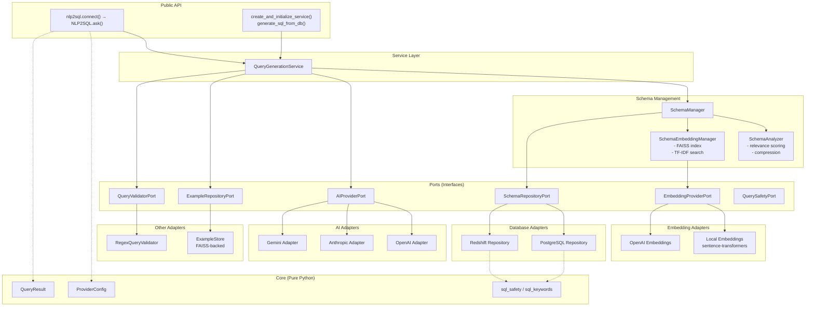
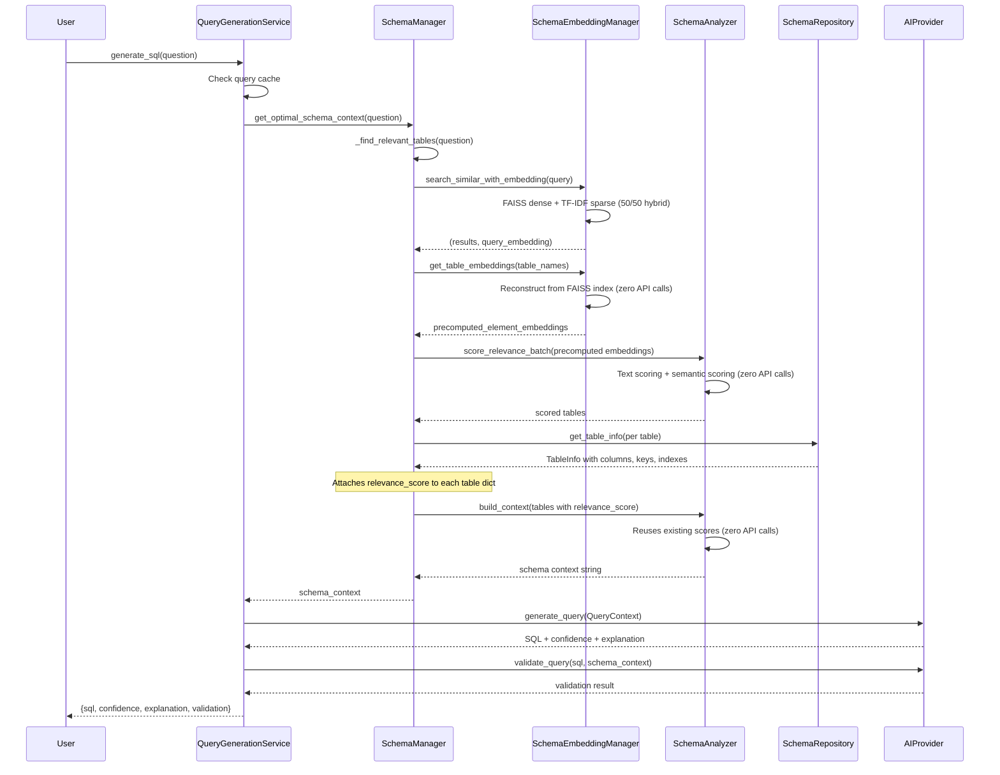

# Architecture

nlp2sql follows Clean Architecture (Hexagonal/Ports & Adapters) principles, enabling multi-provider support and maintainability at enterprise scale.

## Component Diagram



## Component Descriptions

### Public API

Entry points for the library:

| Function | Purpose |
|----------|---------|
| `nlp2sql.connect()` | **Recommended.** DSL entry point: returns `NLP2SQL` client with `.ask()`, `.validate()`, `.explain()` |
| `create_and_initialize_service` | Lower-level: returns `QueryGenerationService` for advanced wiring |
| `create_query_service` | Full manual control; caller must call `initialize()` manually |
| `generate_sql_from_db` | One-shot convenience: creates everything per call |

### Service Layer

**QueryGenerationService** (`services/query_service.py`) orchestrates the full pipeline:

1. Check query cache
2. Get optimal schema context via `SchemaManager`
3. Find relevant examples via `ExampleRepositoryPort` (if configured)
4. Build `QueryContext` and call `AIProvider.generate_query()`
5. Validate columns via `QueryValidatorPort` (retry once if errors found)
6. Optionally optimize via `QueryOptimizerPort`
7. Validate SQL via `AIProvider.validate_query()`
8. Cache valid results

### Schema Management

| Component | File | Responsibility |
|-----------|------|----------------|
| **SchemaManager** | `schema/manager.py` | Coordinates filtering, relevance search, and context building |
| **SchemaAnalyzer** | `schema/analyzer.py` | Scores table/column relevance (text + semantic), compresses schema within token limits |
| **SchemaEmbeddingManager** | `schema/embedding_manager.py` | Maintains FAISS vector index + TF-IDF sparse index for hybrid search |

### Ports (Interfaces)

Abstract contracts in `ports/` that define layer boundaries:

| Port | File | Methods |
|------|------|---------|
| **AIProviderPort** | `ports/ai_provider.py` | `generate_query()`, `validate_query()` |
| **SchemaRepositoryPort** | `ports/schema_repository.py` | `get_tables()`, `get_table_info()`, `get_related_tables()` |
| **EmbeddingProviderPort** | `ports/embedding_provider.py` | `encode()`, `get_embedding_dimension()` |
| **ExampleRepositoryPort** | `ports/example_repository.py` | `add_examples()`, `search_similar()`, `clear()`, `get_stats()` |
| **QueryValidatorPort** | `ports/query_validator.py` | `validate_columns()` |
| **QuerySafetyPort** | `ports/query_safety.py` | `validate()`, `apply_row_limit()` |
| **SchemaStrategyPort** | `ports/schema_strategy.py` | `build_context()`, `score_relevance()`, `chunk_schema()` |
| **CachePort** | `ports/cache.py` | `get()`, `set()`, `clear()` |
| **QueryOptimizerPort** | `ports/query_optimizer.py` | `optimize()` |

### Adapters

Concrete implementations of ports:

| Layer | Adapters | Files |
|-------|----------|-------|
| AI Providers | OpenAI GPT, Anthropic Claude, Google Gemini | `adapters/openai_adapter.py`, `anthropic_adapter.py`, `gemini_adapter.py` |
| Databases | PostgreSQL, Amazon Redshift | `adapters/postgres_repository.py`, `redshift_adapter.py` |
| Embeddings | Local (sentence-transformers), OpenAI | `adapters/local_embedding_adapter.py`, `openai_embedding_adapter.py` |
| Examples | FAISS-backed ExampleStore | `schema/example_store.py` (implements `ExampleRepositoryPort`) |
| Validation | Regex-based column validator | `adapters/regex_query_validator.py` (implements `QueryValidatorPort`) |

## Detailed Query Flow



### Step-by-step with file references

1. **`generate_sql()`** (`services/query_service.py`) -- checks query cache, then calls `SchemaManager.get_optimal_schema_context()`
2. **`get_optimal_schema_context()`** (`schema/manager.py`) -- checks schema cache, then calls `_find_relevant_tables()`
3. **`_find_relevant_tables()`** (`schema/manager.py`) -- two strategies:
   - **Strategy 1**: `SchemaEmbeddingManager.search_similar_with_embedding()` -- FAISS + TF-IDF hybrid search returns candidate tables + the query embedding
   - **Strategy 2**: `SchemaAnalyzer.score_relevance_batch()` -- batch scores token-matched tables using precomputed query + element embeddings (reconstructed from FAISS via `get_table_embeddings()`)
4. **`get_table_info()`** (`ports/schema_repository.py`) -- fetches full table metadata; manager attaches `relevance_score` to each table dict
5. **`build_context()`** (`schema/analyzer.py`) -- builds schema context string within token limits; reuses pre-attached `relevance_score` (no re-scoring, zero additional embedding calls)
6. **`generate_query()`** (`ports/ai_provider.py`) -- AI provider generates SQL from question + schema context
7. **`validate_query()`** (`ports/ai_provider.py`) -- validates SQL syntax and safety

## Schema Relevance Pipeline

The pipeline in `_find_relevant_tables()` (`schema/manager.py`) uses two complementary strategies to find the most relevant tables for a query:

### Strategy 1: Hybrid FAISS + TF-IDF Search

`SchemaEmbeddingManager._search_similar_core()` (`schema/embedding_manager.py`) combines:

- **Dense search (FAISS)**: Semantic similarity via vector embeddings (`IndexFlatIP` inner product). Captures meaning (e.g., "revenue" matches "sales_amount").
- **Sparse search (TF-IDF)**: Exact keyword matching via `TfidfVectorizer` with unigram+bigram features. Captures exact names (e.g., "organizations" matches `organization` table).
- **Hybrid score**: `0.5 * dense_score + 0.5 * sparse_score`. Equal weighting ensures both semantic meaning and exact keyword matches contribute.

This returns candidate tables + the query embedding (for reuse downstream).

### Strategy 2: Batch Scoring with Precomputed Embeddings

`SchemaAnalyzer.score_relevance_batch()` (`schema/analyzer.py`) refines candidates:

1. **Text-based scoring** (fast, no API calls): exact name match, normalized singular/plural matching, token overlap, column-name matching
2. **Semantic scoring** (only for elements with text score < 0.8): uses precomputed embeddings passed from the manager, avoiding new API calls
3. The manager passes both the `query_embedding` from Strategy 1 and `element_embeddings` reconstructed from the FAISS index via `get_table_embeddings()`

### Score Reuse in build_context

`SchemaManager.get_optimal_schema_context()` attaches the final `relevance_score` to each table dict before calling `SchemaAnalyzer.build_context()`. The analyzer checks for this key and skips re-scoring when present. This eliminates ~10-15 embedding API calls per query that would otherwise happen in the per-table `score_relevance()` path.

**Net result**: ~1 embedding API call per query (for the initial FAISS search), down from ~15-18 without these optimizations.

## Caching Layers

The system has multiple caching layers:

| Layer | Scope | Storage | TTL |
|-------|-------|---------|-----|
| **Query result cache** | Full SQL response | `CachePort` (external) | Indefinite (valid results) |
| **Schema context cache** | Built schema string | `CachePort` (external) | Per query+db+tokens key |
| **Table relevance cache** | Relevant tables list | In-memory dict | Per `SchemaManager` instance |
| **All-tables cache** | Filtered table list | In-memory dict (`_schema_cache`) | Until `refresh_schema()` |
| **FAISS + TF-IDF index** | Schema embeddings | Disk (pickle + FAISS) | Until `NLP2SQL_SCHEMA_CACHE_TTL_HOURS` expires |
| **Query embedding cache** | Per-query embeddings | In-memory dict | Cleared per `_find_relevant_tables()` call |
| **Repository disk cache** | Schema metadata (Redshift) | Pickle file | `NLP2SQL_SCHEMA_CACHE_TTL_HOURS` |

## Design Decisions

| Decision | Rationale |
|----------|-----------|
| **Ports & Adapters** | Swap AI/DB/embedding providers without touching core logic. Adding a new provider means implementing one port interface. |
| **FAISS + TF-IDF hybrid (50/50)** | Semantic embeddings alone miss exact keyword matches (e.g., "count organizations" should find `organization` table). TF-IDF catches these. Equal weighting balances both signals. |
| **Disk-cached FAISS index** | Avoids re-embedding 600+ schema elements on every run. Isolated per database+schema via MD5 hash of `{database_url}:{schema_name}`. |
| **Precomputed embeddings in batch scoring** | `_find_relevant_tables` reuses the query embedding from FAISS search and reconstructs table embeddings from the index. Result: ~1 embedding API call per query instead of ~15. |
| **relevance_score passthrough to build_context** | Manager already scored tables during `_find_relevant_tables`; analyzer reuses those scores in `build_context` instead of re-computing them (zero redundant API calls). |
| **Repository disk cache (Redshift)** | Redshift's `SVV_TABLES`/`SVV_COLUMNS` queries are expensive. Bulk query + pickle cache avoids repeated system catalog scans. |
| **Graceful embedding degradation** | System works without embeddings (text-based matching only). If `sentence-transformers` is not installed, logs a warning and continues. |
| **Schema filters applied before indexing** | Filters reduce the number of elements indexed in FAISS, making search faster and more focused. |
| **DSL `connect()` + `ask()`** | Pythonic API inspired by httpx/redis-py. Auto-detects database type, auto-creates embeddings, accepts plain dicts for examples. Wraps `QueryGenerationService` without replacing it. |
| **ProviderConfig** | Single object for AI provider settings (provider, api_key, model, temperature, max_tokens). Eliminates scattered params across factory functions. |
| **QueryResult** | Typed dataclass instead of raw dict. `.sql`, `.confidence`, `.is_valid` instead of `result["sql"]`, `result["validation"]["is_valid"]`. |
| **SQL safety in core** | `is_safe_query()` and `DANGEROUS_SQL_PATTERNS` moved from adapters to `core/sql_safety.py`. Eliminates duplication between PostgreSQL and Redshift adapters. |
| **QueryValidatorPort** | Column validation logic (90 lines of regex) extracted from service to `adapters/regex_query_validator.py`. Enables future `sqlglot`-based implementation. |
| **ExampleRepositoryPort** | Few-shot examples behind a port interface. `ExampleStore` (FAISS) is one implementation; users can provide DB-backed or API-backed stores. |

## Directory Structure

```
src/nlp2sql/
├── client.py       # DSL: connect() + NLP2SQL class (recommended entry point)
├── __init__.py     # Public API: exports, factory functions
├── core/           # Pure Python, no external dependencies
│   ├── entities.py         # Query, SQLQuery, DatabaseType
│   ├── provider_config.py  # ProviderConfig (AI provider settings)
│   ├── result.py           # QueryResult (typed result from ask())
│   ├── database_prompts.py # SQL dialect hints for AI providers
│   ├── sql_safety.py       # is_safe_query(), apply_row_limit(), DANGEROUS_SQL_PATTERNS
│   └── sql_keywords.py     # SQL_KEYWORDS frozenset (shared by validators)
├── ports/          # Interfaces/abstractions
│   ├── ai_provider.py       # AIProviderPort, QueryContext, QueryResponse
│   ├── schema_repository.py # SchemaRepositoryPort, TableInfo
│   ├── embedding_provider.py # EmbeddingProviderPort
│   ├── example_repository.py # ExampleRepositoryPort (few-shot examples)
│   ├── query_validator.py   # QueryValidatorPort (column validation)
│   ├── query_safety.py      # QuerySafetyPort (SQL safety checks)
│   ├── schema_strategy.py   # SchemaStrategyPort, SchemaContext, SchemaChunk
│   ├── cache.py             # CachePort
│   └── query_optimizer.py   # QueryOptimizerPort
├── adapters/       # External implementations
│   ├── openai_adapter.py           # OpenAI GPT
│   ├── anthropic_adapter.py        # Anthropic Claude
│   ├── gemini_adapter.py           # Google Gemini
│   ├── postgres_repository.py      # PostgreSQL
│   ├── redshift_adapter.py         # Amazon Redshift (with disk cache)
│   ├── local_embedding_adapter.py  # sentence-transformers
│   ├── openai_embedding_adapter.py # OpenAI embeddings
│   └── regex_query_validator.py    # Regex-based column validation
├── services/       # Application services
│   └── query_service.py    # QueryGenerationService (orchestrator)
├── schema/         # Schema management
│   ├── manager.py           # SchemaManager (coordinates strategies)
│   ├── analyzer.py          # SchemaAnalyzer (scoring, compression)
│   ├── embedding_manager.py # SchemaEmbeddingManager (FAISS + TF-IDF)
│   └── example_store.py     # ExampleStore (implements ExampleRepositoryPort)
├── config/         # Configuration
│   └── settings.py          # Pydantic Settings (centralized defaults)
├── utils/          # Shared utilities
│   └── storage.py           # get_data_directory() (disk persistence)
├── exceptions/     # Custom exception hierarchy
└── factories.py    # RepositoryFactory
```

## Related Documentation

- [API Reference](API.md) - Python API and CLI
- [Configuration](CONFIGURATION.md) - Environment variables and design rationale
- [Enterprise Guide](ENTERPRISE.md) - Large-scale deployment
- [Redshift Support](Redshift.md) - Amazon Redshift setup
