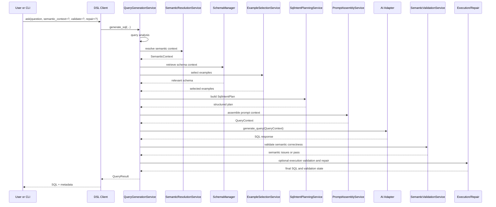
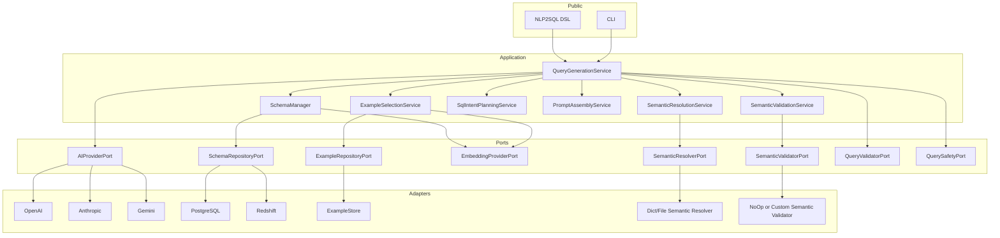

# Architecture

`nlp2sql` follows a hexagonal architecture: the public DSL and CLI sit at the edge, the core domain stays pure, and adapters implement provider- or infrastructure-specific behavior.

The important shift in the current architecture is that SQL generation is no longer treated as just:

`question -> schema -> SQL`

It is now modeled as:

`question -> semantic resolution -> schema/examples retrieval -> SQL intent plan -> prompt assembly -> SQL -> semantic/execution validation`

## Runtime Overview

```mermaid
flowchart TD
    userCode[User code or CLI] --> dsl[connect() / ask()]
    dsl --> qgs[QueryGenerationService]
    qgs --> analysis[Query analysis]
    analysis --> semantic[SemanticResolutionService]
    semantic --> schema[Schema retrieval]
    semantic --> examples[Example selection]
    schema --> intent[SqlIntentPlanningService]
    examples --> intent
    intent --> prompt[PromptAssemblyService]
    prompt --> provider[AIProviderPort adapter]
    provider --> semval[SemanticValidationService]
    semval --> exec[Optional execution validation and repair]
    exec --> result[QueryResult metadata]
```

## Public Surfaces

The recommended entry point is the DSL:

- `await nlp2sql.connect(...)`
- `await nlp.ask(...)`

Other entry points still exist for advanced wiring:

- `create_and_initialize_service(...)`
- `create_query_service(...)`
- `generate_sql_from_db(...)`

The CLI maps onto the same runtime concepts through `nlp2sql query`, `inspect`, `benchmark`, and cache commands.

## Layers

### Core Domain

The core layer contains the stable business-agnostic abstractions:

- `ProviderConfig`
- `QueryResult`
- `SemanticContext`
- `SqlIntentPlan`
- `SemanticValidationResult`
- SQL safety and keyword utilities

These objects are designed so a service can pass semantic business meaning without hardcoding any specific private warehouse.

### Ports

Ports define the boundaries between orchestration and infrastructure:

| Port | Purpose |
|------|---------|
| `AIProviderPort` | Generate and validate SQL through a model provider |
| `SchemaRepositoryPort` | Read table and column metadata from PostgreSQL or Redshift |
| `EmbeddingProviderPort` | Produce embeddings for schema and example retrieval |
| `ExampleRepositoryPort` | Retrieve few-shot examples |
| `SemanticResolverPort` | Resolve business context for a question |
| `SemanticValidatorPort` | Validate generated SQL against business rules |
| `QueryValidatorPort` | Detect column-level query issues |
| `QuerySafetyPort` | Enforce readonly and safety rules |
| `CachePort` | External cache for reusable results |

### Adapters

Adapters implement those ports:

| Area | Adapters |
|------|----------|
| AI providers | OpenAI, Anthropic, Gemini |
| Databases | PostgreSQL, Redshift |
| Embeddings | local sentence-transformers, OpenAI embeddings |
| Examples | `ExampleStore` and any custom repository implementation |
| Semantic resolution | no-op, dictionary-backed, file-backed |
| Semantic validation | no-op and custom validator implementations |
| Query validation | regex-based validator today, swappable later |

### Application Services

The orchestration layer is centered on `QueryGenerationService`, which now composes several focused services:

| Service | Responsibility |
|---------|----------------|
| `QueryGenerationService` | End-to-end orchestration |
| `SemanticResolutionService` | Resolve and merge semantic context |
| `SchemaManager` | Retrieve and compress schema context |
| `ExampleSelectionService` | Find and rerank few-shot examples |
| `SqlIntentPlanningService` | Build a structured plan before prompting |
| `PromptAssemblyService` | Assemble the final `QueryContext` |
| `SemanticValidationService` | Detect semantically wrong but syntactically valid SQL |

## End-to-End Query Flow



## Detailed Pipeline

### 1. Query Analysis

The pipeline begins by extracting lightweight intent hints from the question, such as candidate metrics, dimensions, filters, or time expressions. This step gives later services a normalized starting point even when no examples or semantic context are provided.

### 2. Semantic Resolution

Semantic resolution is optional but first-class.

Possible inputs:

- no semantic context at all
- a per-client `semantic_context`
- a per-request `semantic_context`
- a `semantic_resolver` hook
- a file- or dict-backed semantic resolver used by the CLI

The output is a `SemanticContext` that may contain:

- canonical tables
- supporting tables
- required filters
- entity mappings
- metric definitions
- dimension definitions
- rules
- canonical query patterns

This step is what lets business meaning steer the rest of the pipeline without baking private conventions into the library.

### 3. Schema Retrieval

`SchemaManager` retrieves relevant schema using:

- schema filters
- disk-backed schema metadata
- dense retrieval with embeddings
- sparse retrieval with TF-IDF
- score reuse during context compression

This is the main defense against very large schemas.

### 4. Example Selection

Few-shot examples are optional. If present, they are treated as a separate retrieval artifact, not as a replacement for schema retrieval.

Selection can be influenced by:

- question similarity
- semantic context
- canonical table overlap
- filter overlap

This keeps examples aligned with the resolved business intent instead of only the raw question text.

### 5. SQL Intent Planning

Before building the final prompt, the system creates a `SqlIntentPlan`.

The plan captures:

- domain
- fact table
- supporting tables
- dimensions
- metrics
- filters
- time range hints
- grouping hints
- ordering hints

This is the bridge between semantic meaning and SQL generation. It narrows the solution space for the model and makes the resulting metadata easier to inspect.

### 6. Prompt Assembly

`PromptAssemblyService` creates a `QueryContext` for the AI provider. That context includes:

- question
- compressed schema context
- selected examples
- semantic context metadata
- SQL intent plan metadata

The provider adapters then render this information into provider-specific prompts.

### 7. Generation

The AI provider generates SQL using the assembled context. Providers are interchangeable because they all sit behind `AIProviderPort`.

### 8. Semantic Validation

After generation, the system can validate the SQL against business rules. This catches failures that would otherwise slip through syntax-only validation, for example:

- missing required filters
- missing required dimensions
- use of disallowed tables
- failure to honor a canonical table choice

### 9. Optional Execution and Repair

If execution is enabled:

- the query may be executed in readonly mode
- execution failures can trigger repair
- semantic failures can also trigger repair

This is how the library supports `generate_only`, `generate_and_validate`, and `generate_validate_repair`.

## Component Map



## Caching and Persistence

The architecture uses several cache layers:

| Layer | Purpose | Typical Storage |
|-------|---------|-----------------|
| schema embedding cache | reuse schema retrieval indexes | disk |
| example embedding cache | reuse example search indexes | disk |
| repository schema cache | avoid repeated catalog scans | disk or memory |
| query result cache | reuse final query results | external cache port |
| in-process relevance caches | avoid repeated scoring inside a run | memory |

The key architectural rule is that caches accelerate the pipeline but do not redefine it. Semantic context, example retrieval, and SQL planning remain explicit steps whether caches are warm or cold.

## Design Decisions

| Decision | Why it matters |
|----------|----------------|
| DSL-first public API | Most users want `connect()` and `ask()`, not low-level service construction |
| Semantic context as a first-class entity | Business meaning can be injected without forking the library |
| Intent planning before prompting | Keeps SQL generation structured and inspectable |
| Examples behind a port | Examples can come from files, memory, databases, or external systems |
| Semantic validation after generation | Catches wrong SQL that still parses and executes |
| Ports and adapters | Lets teams swap providers and infrastructure without rewriting orchestration |
| Public examples tied to local e-commerce schema | Keeps docs safe, portable, and reproducible |

## Public Example Domain

When the docs or tests refer to business concepts, they refer to the repository's local e-commerce schema, such as:

- `stores`
- `marketing_channels`
- `daily_channel_metrics`
- `orders`
- `order_items`

This keeps the public architecture documentation grounded in a real domain without relying on private warehouse names.

## Related Docs

- [README](../README.md)
- [API Reference](API.md)
- [Configuration](CONFIGURATION.md)
- [Enterprise Guide](ENTERPRISE.md)
- [Redshift Support](Redshift.md)
